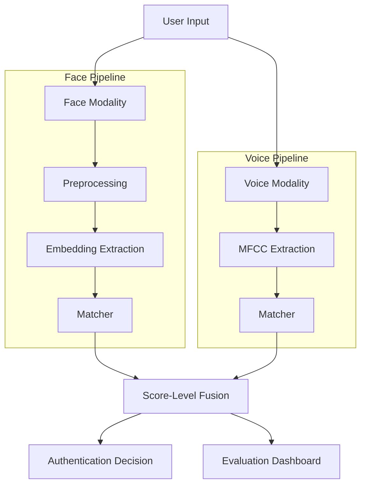

# 🛡️ IDentix - Multi-Modal Biometric Authentication System

A production-grade biometric authentication system combining **Face Recognition** and **Voice Verification** using deep learning. Built with Flask (Backend) and React (Frontend) for real-world security applications.

---

## 📋 Table of Contents
- [Overview](#overview)
- [Applications & Use Cases](#applications--use-cases)
- [System Architecture](#system-architecture)
- [Technologies Used](#technologies-used)
- [Installation & Setup](#installation--setup)
- [How to Use](#how-to-use)
- [Project Structure](#project-structure)
- [API Documentation](#api-documentation)
- [References](#references)

---

## 🎯 Overview

**IDentix** is an advanced multi-modal biometric authentication and **attendance management system** that combines:
- **Face Recognition**: Using DeepFace (VGG-Face model) for facial feature extraction
- **Voice Verification**: Using MFCC (Mel-Frequency Cepstral Coefficients) for voice pattern analysis
- **Score-Level Fusion**: Weighted combination of both modalities for enhanced security
- **Person Identification**: 1:N matching to identify individuals from a database
- **Attendance Tracking**: Automatic check-in/check-out logging with timestamps
- **Analytics Dashboard**: Real-time attendance statistics and visualizations
- **Admin Portal**: Secure face-based authentication for administrators

The system achieves higher accuracy than single-modality systems by leveraging the strengths of both face and voice biometrics, and provides a complete attendance management solution with analytics and reporting.

---

## 🏢 Applications & Use Cases

### 1. **Enterprise Security**
- Employee authentication for office access control
- Secure login for corporate systems and sensitive data
- Time and attendance tracking with anti-spoofing

### 2. **Financial Services**
- Bank account verification for high-value transactions
- ATM authentication (face + voice PIN)
- Mobile banking security layer

### 3. **Healthcare**
- Patient identity verification in hospitals
- Secure access to electronic health records (EHR)
- Prescription authorization

### 4. **Government & Border Control**
- Airport security and immigration checkpoints
- National ID verification systems
- Law enforcement identity confirmation

### 5. **Smart Home & IoT**
- Multi-user home automation systems
- Personalized device access (smart locks, cars)
- Parental controls with voice + face verification

### 6. **Education**
- Exam proctoring and student verification
- Campus access control
- Online learning authentication

---

## 🏗️ System Architecture



### Detailed Architecture

IDentix follows a **modular pipeline architecture**:

1. **Data Acquisition**: 
   - Face images and voice recordings are captured from users
   - Supports multiple input formats (JPG, PNG for images; WAV, MP3 for audio)

2. **Preprocessing Layer**:
   - **Face**: Detection using Haar Cascades, alignment, and resizing to 224×224
   - **Voice**: Audio loading, silence trimming, duration normalization (3 seconds)

3. **Feature Extraction Layer**:
   - **Face**: DeepFace extracts 2622-dimensional embeddings using VGG-Face
   - **Voice**: Librosa extracts 13 MFCC coefficients

4. **Matching Layer**:
   - **Face**: Cosine similarity between probe and gallery embeddings
   - **Voice**: Euclidean distance converted to similarity score

5. **Fusion Layer**:
   - Score-level fusion using weighted sum (Face: 60%, Voice: 40%)
   - Configurable weights based on application requirements

6. **Decision Layer**:
   - Threshold-based authentication (default: 0.7)
   - Returns verification status and individual/fused confidence scores

```

---

## 🛠️ Technologies Used

### **Backend (Python)**
| Technology | Purpose |
|------------|---------|
| **Flask** | REST API server |
| **DeepFace** | Face recognition (VGG-Face model) |
| **Librosa** | Audio processing & MFCC extraction |
| **NumPy** | Numerical computations |
| **OpenCV** | Image preprocessing |
| **Flask-CORS** | Cross-origin resource sharing |

### **Frontend (JavaScript)**
| Technology | Purpose |
|------------|---------|
| **React** | UI framework |
| **Vite** | Build tool & dev server |
| **Tailwind CSS v4** | Styling & design system |
| **Axios** | HTTP client for API calls |

### **Machine Learning Models**
- **VGG-Face**: Pre-trained CNN for face embeddings (2622-dimensional vectors)
- **MFCC**: 13-coefficient audio feature extraction for voice patterns

---

## 📦 Installation & Setup

### Prerequisites
- **Python 3.8+**
- **Node.js 16+** and npm
- **Git**

### Step 1: Clone the Repository
```bash
git clone https://github.com/A7med580/IDentix.git
cd IDentix
```

### Step 2: Backend Setup
```bash
# Install Python dependencies
pip install -r requirements.txt
```

### Step 3: Frontend Setup
```bash
cd frontend
npm install
cd ..
```

### Step 4: Prepare Feature Database (Optional)
If you have precomputed biometric features:
1. Place `face_embeddings.npy` in `data/features/`
2. Place `voice_mfccs.npy` in `data/features/`

*Alternatively, use the Colab notebook in `docs/IDentix_Colab_Preprocessing.ipynb` to generate these files.*

---

## 🚀 How to Use

### Starting the System

**Terminal 1 - Backend API:**
```bash
python3 server.py
```
The API will start on `http://localhost:5001`

**Terminal 2 - Frontend UI:**
```bash
cd frontend
npm run dev
```
The UI will start on `http://localhost:5173`

### Using the Application

1. **Open the Web Interface**
   - Navigate to `http://localhost:5173` in your browser

2. **Upload Biometric Data**
   - **Face**: Click "Browse files" under "Face Identification" and select a face image (JPG/PNG)
   - **Voice**: Click "Browse files" under "Voice Verification" and select an audio file (WAV/MP3)
   - You can upload one or both modalities

3. **Verify Identity**
   - Click the **"VERIFY IDENTITY"** button
   - The system will process your inputs and display:
     - Individual confidence scores (Face & Voice)
     - Fused confidence score
     - Authentication result (GRANTED/DENIED)

4. **Interpret Results**
   - **Fused Score ≥ 70%**: Access Granted ✅
   - **Fused Score < 70%**: Access Denied ❌

## 📸  Screenshots

| Dashboard | Person Details |
|-----------|----------------|
|  |  |
| **Real-time Analytics** | **Individual Stats** |

| Verification | Admin Login |
|--------------|-------------|
|  |  |
| **Face & Voice Check-in** | **Secure Access** |

---

## 📚 Documentation

- [**Deployment Guide**](docs/DEPLOYMENT.md): Instructions for deploying to production.
- [**Demo Script**](docs/DEMO_SCRIPT.md): Script for showcasing the system features.
- [**User Manual**](docs/USER_MANUAL.md): Comprehensive guide for end-users.
- [**API Reference**](README.md#api-documentation): Detailed API endpoints documentation.

---

## 🏢 Attendance Management Features

### Admin Dashboard
Access the admin portal at `http://localhost:5173/dashboard` to:
- View **real-time attendance statistics** (total persons, present today, late count)
- See **visual analytics** with pie charts showing attendance distribution
- Monitor **today's attendance log** with check-in/check-out times
- Access quick actions for person management

### Person Management
- **Add New Person**: Register employees with face, voice, and personal information
- **View All Persons**: Browse, search, and filter the 20 registered persons
- **Person Details**: View individual analytics including:
  - Attendance percentage
  - On-time vs late statistics
  - Complete attendance history

### Attendance Tracking
- **Automatic Check-in**: Upload face/voice → System identifies person → Logs attendance
- **Person Identification**: 1:N matching shows who checked in
- **Timestamp Recording**: Captures exact check-in and check-out times
- **Status Classification**: Automatically marks as "on-time" or "late" (threshold: 9:00 AM)

### Analytics & Reporting
- **Dashboard Overview**: Total persons, present today, late count, attendance rate
- **Individual Analytics**: Per-person statistics and attendance history
- **Visual Charts**: Pie charts for attendance distribution and status breakdown
- **Historical Data**: 6 months of pre-loaded attendance records (Aug 2025 - Feb 2026)

### Demo Data
The system comes pre-loaded with:
- **20 fake people** with realistic profiles (names, emails, departments)
- **2,458 attendance records** spanning 6 months
- **Realistic patterns**: Perfect attendance, good, average, and poor performers
- **Complete biometric data**: Face embeddings and voice MFCCs for each person


---

## 📁 Project Structure

```
IDentix/
├── server.py                    # Flask API entry point
├── main.py                      # Legacy Streamlit UI (deprecated)
├── requirements.txt             # Python dependencies
│
├── preprocessing/               # Data preprocessing modules
│   ├── face_prep.py            # Face detection & alignment
│   └── voice_prep.py           # Audio loading & normalization
│
├── feature_extraction/          # Feature extraction modules
│   ├── face_features.py        # DeepFace embeddings
│   └── voice_features.py       # MFCC extraction
│
├── models/                      # Matching algorithms
│   └── matcher.py              # Biometric matching logic
│
├── fusion/                      # Multi-modal fusion
│   └── fusion_engine.py        # Score-level fusion
│
├── evaluation/                  # Performance metrics
│   └── metrics.py              # Accuracy, EER, ROC curves
│
├── utils/                       # Utility modules (NEW)
│   ├── database_manager.py     # JSON database operations
│   └── fake_data_generator.py  # Generate demo data
│
├── data/                        # Data storage
│   ├── database.json           # Attendance database (NEW)
│   └── features/               # Precomputed biometric features
│       ├── face_embeddings.npy
│       └── voice_mfccs.npy
│
├── frontend/                    # React application
│   ├── src/
│   │   ├── App.jsx             # Main UI with routing
│   │   ├── index.css           # Tailwind styles
│   │   ├── main.jsx            # React entry point
│   │   ├── components/         # Reusable components (NEW)
│   │   │   └── Navbar.jsx      # Navigation bar
│   │   └── pages/              # Page components (NEW)
│   │       ├── AdminLogin.jsx  # Admin authentication
│   │       ├── Dashboard.jsx   # Analytics dashboard
│   │       ├── PersonsList.jsx # All persons table
│   │       ├── AddPerson.jsx   # Person registration
│   │       ├── PersonDetails.jsx # Individual analytics
│   │       └── Verification.jsx # Check-in/out
│   ├── package.json
│   └── vite.config.js
│
└── docs/                        # Documentation
    ├── USER_MANUAL.md          # User guide
    └── IDentix_Colab_Preprocessing.ipynb  # Feature extraction notebook
```

---

## 🔌 API Documentation

### `GET /api/health`
Check system status and database availability.

**Response:**
```json
{
  "status": "online",
  "database": {
    "face": "loaded",
    "voice": "loaded"
  }
}
```

### `POST /api/verify`
Authenticate a user using biometric data (legacy endpoint).

**Request:**
- Content-Type: `multipart/form-data`
- Body:
  - `face` (optional): Image file (JPG/PNG)
  - `voice` (optional): Audio file (WAV/MP3)

**Response:**
```json
{
  "verified": true,
  "scores": {
    "face": 0.87,
    "voice": 0.76,
    "fused": 0.83
  },
  "threshold": 0.7
}
```

### Attendance Management Endpoints

#### `POST /api/admin/login`
Admin authentication via face recognition.

**Request:**
- `face`: Admin face image

**Response:**
```json
{
  "success": true,
  "admin": {
    "id": "admin_001",
    "name": "Admin User"
  }
}
```

#### `GET /api/persons`
Get all registered persons (with optional filters).

**Query Parameters:**
- `status`: Filter by status (active/inactive)
- `department`: Filter by department

**Response:**
```json
{
  "persons": [
    {
      "id": "P001",
      "name": "Angela Valenzuela",
      "employee_id": "EMP001",
      "department": "Engineering",
      "email": "angela.valenzuela@company.com",
      "status": "active"
    }
  ]
}
```

#### `POST /api/persons`
Register a new person.

**Request:**
- Form data: name, employee_id, date_of_birth, gender, department, email, phone
- Files: face (required), voice (optional)

#### `POST /api/attendance/checkin`
Check-in with person identification.

**Request:**
- `face`: Face image
- `voice`: Voice recording (optional)

**Response:**
```json
{
  "verified": true,
  "person": {
    "id": "P001",
    "name": "Angela Valenzuela",
    "employee_id": "EMP001",
    "department": "Engineering"
  },
  "attendance": {
    "id": "ATT00001",
    "date": "2026-02-04",
    "check_in": "08:45:00",
    "status": "on_time"
  },
  "scores": {
    "face": 0.92,
    "voice": 0.85,
    "fused": 0.89
  }
}
```

#### `GET /api/analytics/overview`
Get dashboard statistics.

**Response:**
```json
{
  "total_persons": 20,
  "present_today": 19,
  "late_today": 3,
  "attendance_rate": 95.0
}
```

#### `GET /api/analytics/person/:id`
Get individual person analytics.

**Query Parameters:**
- `start_date`: Start date (YYYY-MM-DD)
- `end_date`: End date (YYYY-MM-DD)

**Response:**
```json
{
  "stats": {
    "total_days_present": 24,
    "attendance_percentage": 100.0,
    "on_time_count": 19,
    "late_count": 5,
    "absent_count": 0
  },
  "history": [...]
}
```

- Content-Type: `multipart/form-data`
- Body:
  - `face` (optional): Image file (JPG/PNG)
  - `voice` (optional): Audio file (WAV/MP3)

**Response:**
```json
{
  "verified": true,
  "scores": {
    "face": 0.87,
    "voice": 0.76,
    "fused": 0.83
  },
  "threshold": 0.7
}
```

---

## 📚 References

### Datasets
- [Face Recognition Dataset](https://www.kaggle.com/datasets/vasukipatel/face-recognition-dataset) - Kaggle
- [Audio MNIST](https://www.kaggle.com/datasets/alanchn31/free-spoken-digits) - Kaggle

### Libraries & Frameworks
- [DeepFace](https://github.com/serengil/deepface) - Face recognition library
- [Librosa](https://librosa.org/) - Audio analysis toolkit
- [Flask](https://flask.palletsprojects.com/) - Python web framework
- [React](https://react.dev/) - JavaScript UI library
- [Tailwind CSS](https://tailwindcss.com/) - Utility-first CSS framework

### Research Papers
- VGG-Face: Deep Face Recognition (Parkhi et al., 2015)
- MFCC: Mel-Frequency Cepstral Coefficients for Speech Recognition

---

## 📄 License

This project is licensed under the MIT License - see the [LICENSE](LICENSE) file for details.

---

## 👨‍💻 Author

**Ahmed Mohamed Ali**
- GitHub: [@A7med580](https://github.com/A7med580)

---

## 🙏 Acknowledgments

- DeepFace contributors for the excellent face recognition library
- Kaggle community for providing open datasets
- The open-source community for the amazing tools and frameworks

---

**Built with ❤️ for secure, intelligent authentication systems**
