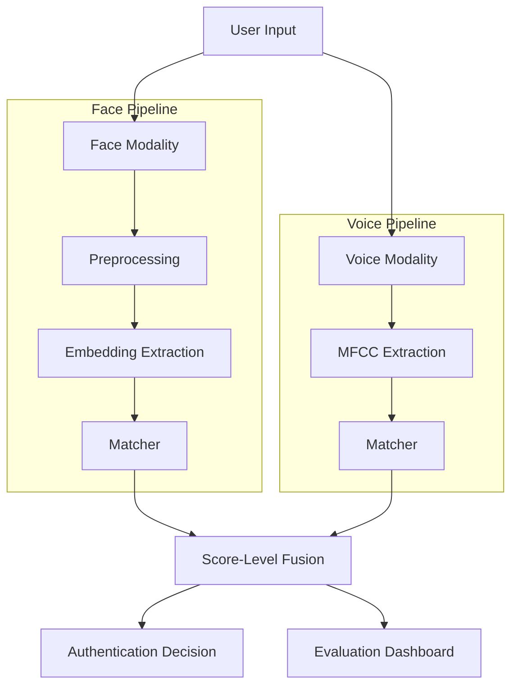

# IDentix — Multi-Application Biometric Authentication System

IDentix is an academically rigorous multi-modal biometric authentication system that integrates **Face Recognition** and **Speaker (Voice) Recognition** within a unified architecture. It demonstrates the quantitative advantages of multi-biometric fusion over single-modality approaches.

## 🚀 Overview

This project implements a score-level fusion architecture to combine biometric inputs. It includes automated dataset management, feature extraction pipelines, and a professional Streamlit-based evaluation dashboard.

### Key Features
- **Multi-Modal Fusion**: Score-level fusion for improved reliability.
- **Deep Learning Embeddings**: Face recognition using DeepFace.
- **Signal Processing**: Voice recognition using MFCC extraction.
- **Cloud-Ready**: Dedicated Google Colab notebook for high-performance preprocessing.
- **Analytics**: ROC curves, EER calculation, and comprehensive performance metrics.

---

## 🏗️ System Architecture



---

## 📂 Dataset Setup

The system uses the following Kaggle datasets:
1. **Face**: [vasukipatel/face-recognition-dataset](https://www.kaggle.com/datasets/vasukipatel/face-recognition-dataset)
2. **Voice**: [kongaevans/speaker-recognition-dataset](https://www.kaggle.com/datasets/kongaevans/speaker-recognition-dataset)
3. **Iris (Extension)**: [olankadhim/multimodal-biometric-dataset-mulb](https://www.kaggle.com/datasets/olankadhim/multimodal-biometric-dataset-mulb)

### Automated Download
Run the following script to download the datasets:
```bash
python data/download_datasets.py
```
After downloading, copy the printed paths into `config/paths_config.py`.

---

## 🛠️ Installation & Running

1. **Install Dependencies**:
   ```bash
   pip install -r requirements.txt
   ```

2. **Run Preprocessing (Optional for Local)**:
   For local runs, ensure datasets are in the paths defined in `config/paths_config.py`.

3. **Launch the Dashboard**:
   ```bash
   streamlit run main.py
   ```

---

## 🧪 Evaluation Methodology

- **Split**: 80% Train / 20% Test.
- **Metrics**: Accuracy, Precision, Recall, F1-Score, ROC/AUC.
- **Fusion**: Score-level fusion using weighted averaging of modality scores.

---

## 📚 References

### Datasets
1. **Face Recognition**: Patel, V. (2020). *Face Recognition Dataset*. Kaggle. Available at: [https://www.kaggle.com/datasets/vasukipatel/face-recognition-dataset](https://www.kaggle.com/datasets/vasukipatel/face-recognition-dataset)
2. **Speaker Recognition**: Evans, K. (2020). *Speaker Recognition Dataset*. Kaggle. Available at: [https://www.kaggle.com/datasets/kongaevans/speaker-recognition-dataset](https://www.kaggle.com/datasets/kongaevans/speaker-recognition-dataset)
3. **Multimodal Biometrics**: Kadhim, O. (2021). *Multimodal Biometric Dataset (MULB)*. Kaggle. Available at: [https://www.kaggle.com/datasets/olankadhim/multimodal-biometric-dataset-mulb](https://www.kaggle.com/datasets/olankadhim/multimodal-biometric-dataset-mulb)

### Libraries
- **DeepFace**: Sefik Ilkin Serengil, Alper Ozpinar. (2020). *LightFace: A Hybrid Deep Face Recognition Framework*. In Proceedings of the 2020 Innovations in Intelligent Systems and Applications Conference (ASYU).
- **Librosa**: McFee, B., et al. (2015). *librosa: Audio and Music Signal Analysis in Python*. In Proceedings of the 14th Python in Science Conference (SCIPY).
